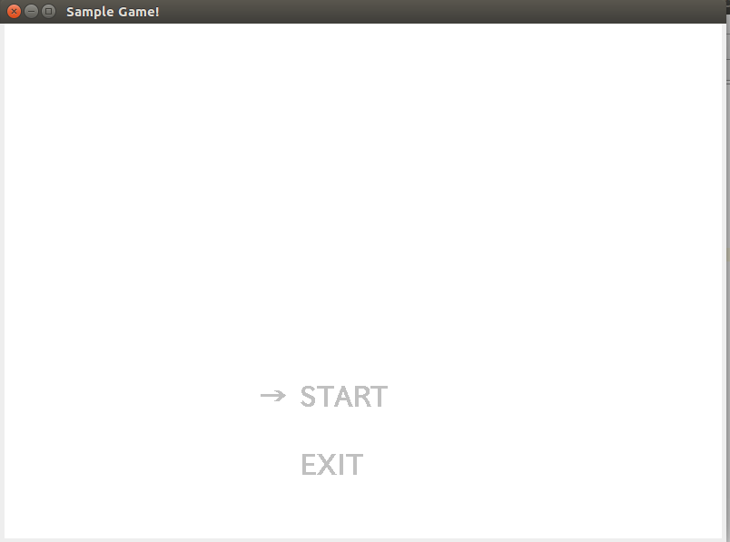
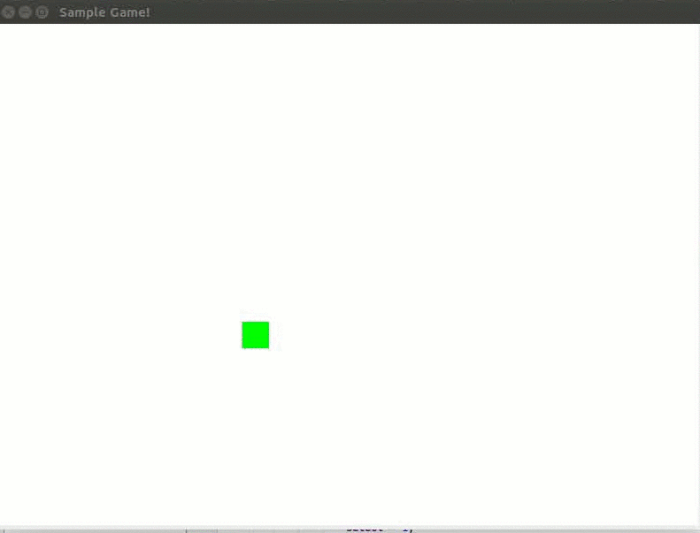

# Swingで作ったシンプルなゲームのサンプル

キー入力で、自機を動かせるプログラム。
以下の３つのファイルがソースコード
- SampleKeyGame.java
- Key.java
- Player.java

## 入力できるキーの説明
| キー | 説明 |
|:-----|:-----|
| Enter | 決定 |
| ↑ | 上 |
| ↓ | 下 |
| ← | 左 |
| → | 右 |

## 実行結果

